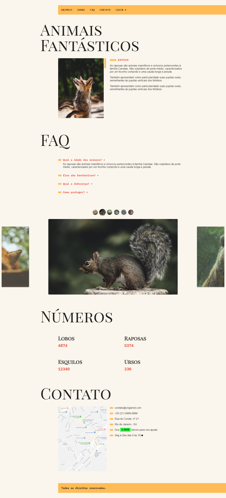

# 💻 ANIMAIS FANTÁSTICOS

---

## 🗒️ Sobre o projeto

Animais Fantásticos é um site com informações sobre animais.

O site contém uma navbar onde existe um dropdown no item "sobre" e um modal se abre ao clicar em "login". 
Em seguida existe uma tabnav onde ao clicar é exibida as informações após uma breve animação css e de acordo com a imagem do animal clicado. 
Na seção de FAQ existe a animação de accordion, cada pergunta ao ser clicada extende ou recolhe a resposta.
Um slide é exibido com as fotos dos animais e a navegação é possível tanto ao clicar nas pequenas imagens acima quanto ao arrastar o slide para os lados. 
A cotação do bitcoin é recebida através da api: "https://blockchain.info/ticker"

Todo o código foi feito em modules e foi usado o webpack e babel tanto para os modulos quanto para traspilar o código.

<a href="https://vleonecezar.github.io/animais-fantasticos/">CLIQUE AQUI PARA TESTAR</a>

---

## 🛠 Tecnologias

### Frontend:

-   HTML
-   CSS
-   JavaScript

---

## 🎨 Screens

### Web

  

### Mobile

  

